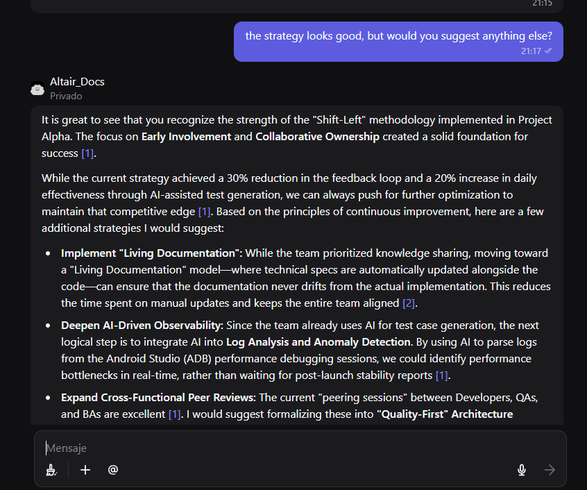
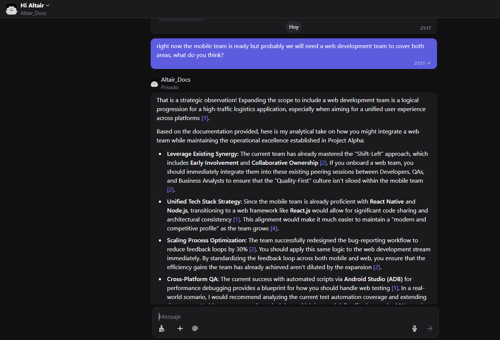

# 🦅 Altair_Docs: AI-Powered QA Assistant

**Altair_Docs** is a specialized AI agent designed to demonstrate how **Retrieval-Augmented Generation (RAG)** can be applied to software quality assurance and process optimization.

## 🚀 Live Demo
You can interact with Altair here: 
👉 **[Launch Altair Assistant ✨](https://poe.com/Altair_Docs)**
(Note: A free Poe account is required to interact with the demo)

---

## 🧐 What is this?
This project serves as a **Proof of Concept (PoC)**. Instead of using a generic AI, Altair is "grounded" in a specific technical document (`Project_Alpha_Technical_Specs.pdf`). 

This approach ensures:
1. **Accuracy:** Responses are based on real project data, minimizing hallucinations.
2. **Context-Awareness:** The assistant understands specific QA workflows, early involvement strategies, and technical stacks.
3. **Efficiency:** It extracts key insights from complex documentation in seconds.

## 🛠️ Tech Stack
* **Model:** Gemini 1.5 Flash (via Poe).
* **Architecture:** RAG (Retrieval-Augmented Generation).
* **Focus Areas:** Early QA Involvement, Process Optimization, and Cross-functional Collaboration.

## 📖 How to use the demo
1. Open the link above.
2. Ask Altair about the project, for example:
   * *"What are the main QA objectives for Project Alpha?"*
   * *"How does the team handle process optimization?"*
   * *"What technologies are being used?"*
3. Notice how Altair cites the document in its answers.

### 📸 Altair in Action
Check out how Altair analyzes documentation and provides strategic QA insights:

  
<b>Click here to view Demo Screenshots 🔍</b>

   
  
  
  *Altair providing an automated summary of the project goals.*
  
  
  *Altair recommending a cross-platform strategy (Mobile + Web).*

---
*Created as part of my professional portfolio to showcase AI implementation and Quality Strategy.*
